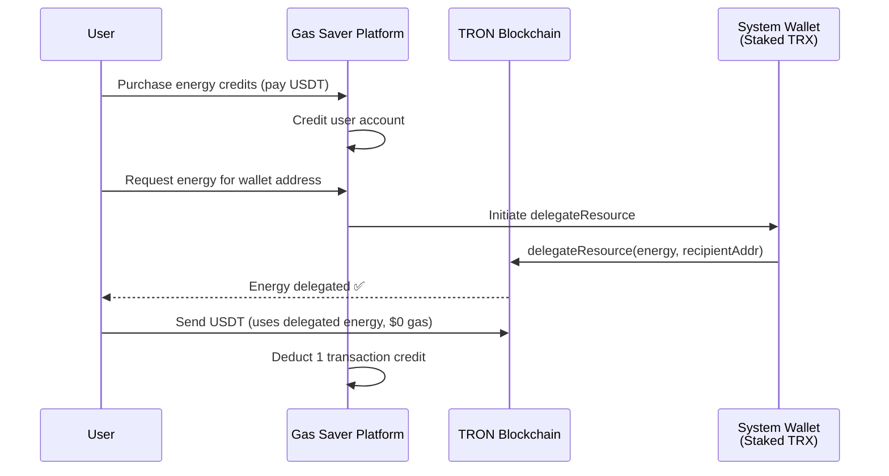
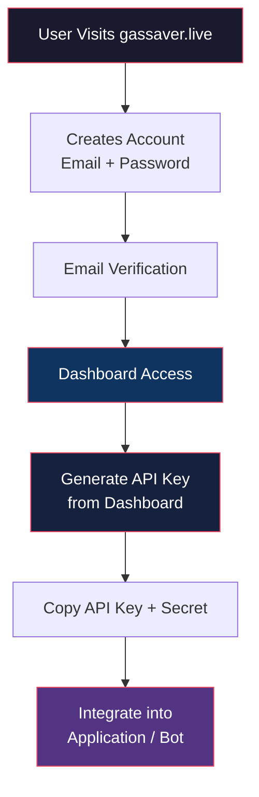
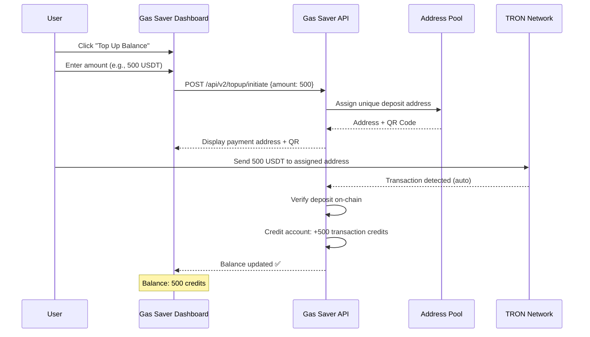
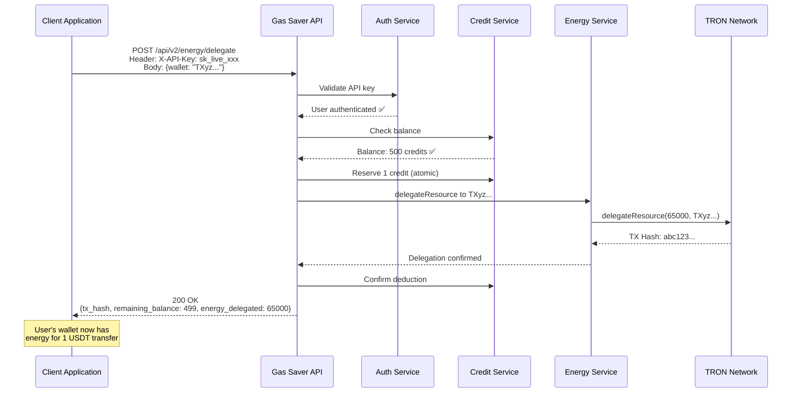
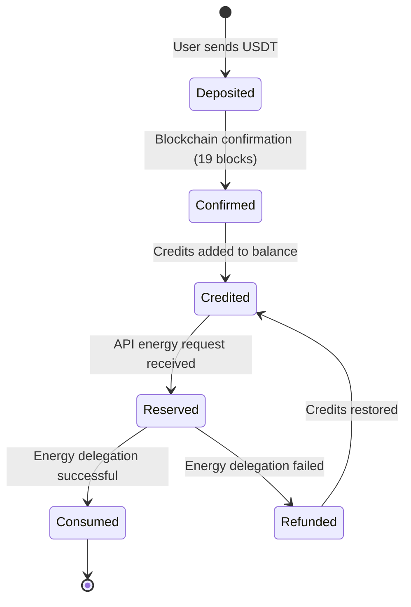
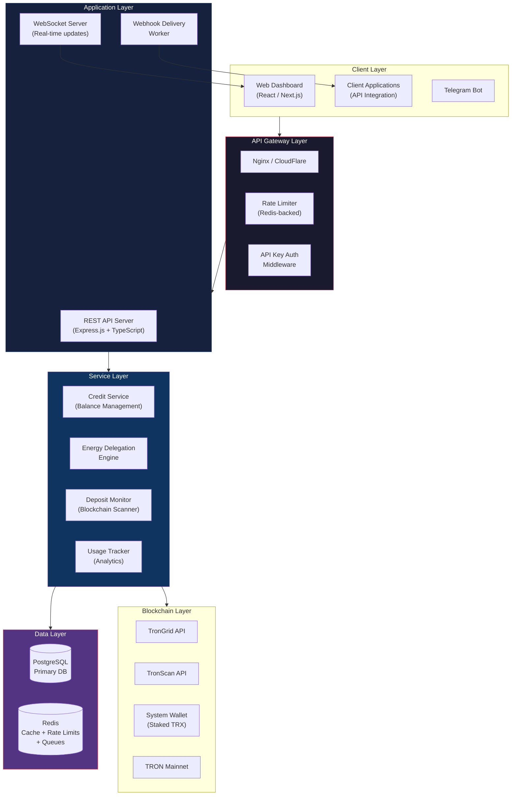

# Gas Saver — Product Requirement Document
## API-Driven Energy-as-a-Service Platform for TRON TRC-20 Transactions

> **Version** 1.0 · April 2026  
> **Website** [gassaver.live](https://www.gassaver.live)  
> **Classification** Confidential — For Developers, Investors & Strategic Partners

---

## Table of Contents

1. [Executive Summary](#1-executive-summary)
2. [Market Problem](#2-market-problem)
3. [The Gas Saver Solution](#3-the-gas-saver-solution)
4. [Current Working Model (v1)](#4-current-working-model-v1)
5. [Current System Architecture](#5-current-system-architecture)
6. [Limitations of the Current Model](#6-limitations-of-the-current-model)
7. [Proposed Upgrade: API-Based Dynamic Energy Delivery (v2)](#7-proposed-upgrade-api-based-dynamic-energy-delivery-v2)
8. [User Flow — API-Based Model](#8-user-flow--api-based-model)
9. [Balance & Credit System](#9-balance--credit-system)
10. [API Key & Authentication Model](#10-api-key--authentication-model)
11. [Transaction Deduction Logic](#11-transaction-deduction-logic)
12. [API Specification (Proposed)](#12-api-specification-proposed)
13. [Dashboard Requirements](#13-dashboard-requirements)
14. [Technical Architecture (v2)](#14-technical-architecture-v2)
15. [Database Schema Evolution](#15-database-schema-evolution)
16. [Scalability & Security Considerations](#16-scalability--security-considerations)
17. [Use Cases & Target Segments](#17-use-cases--target-segments)
18. [Revenue Model & Unit Economics](#18-revenue-model--unit-economics)
19. [Roadmap & Milestones](#19-roadmap--milestones)
20. [Appendix — Current Codebase Reference](#20-appendix--current-codebase-reference)

---

## 1. Executive Summary

**Gas Saver** is a B2B/B2C platform that dramatically reduces the cost of TRC-20 USDT transactions on the TRON blockchain by providing **delegated energy** instead of requiring users to burn TRX for gas fees.

Every TRC-20 USDT transfer on TRON requires approximately **65,000 energy units**. Users without sufficient energy must pay gas fees in TRX — typically costing **$2.89 – $3.00 per transaction**. Gas Saver acquires and delegates energy to users at a fraction of this cost — currently **$1.00 per transaction** — saving users up to **90% on every transfer**.

The platform is **live and fully operational** with automated blockchain monitoring, deposit processing, and real-time energy delegation via TRON's `delegateResource` protocol.

> [!IMPORTANT]
> **This document proposes an upgrade from the current wallet-linked plan model to a dynamic, API-based energy delivery system** — enabling programmatic, on-demand energy delegation for any wallet address, with a prepaid credit balance.

---

## 2. Market Problem

### 2.1 The Energy Bottleneck on TRON

The TRON network uses a **Bandwidth + Energy** resource model. Every smart contract interaction (including TRC-20 token transfers) consumes energy. Users acquire energy in one of two ways:

| Method | Mechanism | Practical Cost |
|--------|-----------|----------------|
| **Stake TRX** | Lock TRX tokens to generate energy over time | Capital-intensive; requires large TRX holdings |
| **Burn TRX** | Pay TRX gas fees directly at time of transaction | **~$2.89 – $3.00 per USDT transfer** |

For the vast majority of users — especially businesses, OTC desks, payment processors, and automated systems — neither option is practical at scale.

### 2.2 Scale of the Problem

- **TRON processes 8M+ transactions/day**, a significant portion of which are TRC-20 USDT transfers
- **USDT on TRON (TRC-20)** is the most widely used stablecoin network globally, representing over **$60B+ daily transfer volume**
- Businesses processing **100–10,000 USDT transfers/day** face **$289 – $30,000/day** in gas fees
- There is **no native mechanism** for third-party energy delegation in a user-friendly, pay-per-use model

### 2.3 Who Feels the Pain

| Segment | Daily Txns | Monthly Gas Cost (at $2.89/tx) | Monthly Savings with Gas Saver |
|---------|-----------|-------------------------------|-------------------------------|
| Individual Traders | 5–20 | $433 – $1,734 | $278 – $1,114 |
| OTC Trading Desks | 50–500 | $4,335 – $43,350 | $2,782 – $27,825 |
| Payment Processors | 200–5,000 | $17,340 – $433,500 | $11,130 – $278,250 |
| Crypto Exchanges | 1,000–50,000 | $86,700 – $4,335,000 | $55,650 – $2,782,500 |

---

## 3. The Gas Saver Solution

Gas Saver acts as an **energy broker** between entities with excess staked TRX (and therefore excess energy) and users who need energy for TRC-20 transfers.

### 3.1 How It Works (Fundamental Mechanism)



### 3.2 Core Value Proposition

| Dimension | Without Gas Saver | With Gas Saver |
|-----------|-------------------|----------------|
| **Cost per USDT transfer** | $2.89 – $3.00 | **$1.00** |
| **Savings** | — | **Up to 90%** |
| **Setup requirement** | Own TRX, stake tokens | Just top up USDT balance |
| **Capital efficiency** | Lock large TRX holdings | Pay only for what you use |
| **Flexibility** | Fixed to staking wallet | Any wallet, any time |
| **Integration** | Manual | **API-based (proposed)** |

---

## 4. Current Working Model (v1)

### 4.1 Current User Journey

1. **Register** — User creates account with email + password + phone number
2. **Select Package** — Choose a transaction package (50, 100, 200, 300, 400, or 500 transactions)
3. **Provide Wallet Address** — User enters the TRON wallet address that will receive energy
4. **Make Payment** — User sends USDT to a platform-assigned deposit address (unique per deposit, auto-generated from address pool)
5. **Automatic Detection** — System monitors the blockchain via TronGrid/TronScan APIs and detects the USDT deposit within seconds
6. **Energy Delegation** — System delegates energy (131,000 energy units per deposit) to the user's specified wallet using TRON's `delegateResource` protocol
7. **Usage Monitoring** — Background services track the user's USDT transactions and decrement their remaining transaction count
8. **Energy Reclaim** — When all purchased transactions are consumed, the system reclaims delegated energy back to the system wallet

### 4.2 Current Pricing Model

| Package | Transactions | Cost (USDT) | Per-Transaction Rate |
|---------|-------------|-------------|---------------------|
| Starter | 50 | 50 | $1.00 |
| Basic | 100 | 100 | $1.00 |
| Standard | 200 | 200 | $1.00 |
| Professional | 300 | 300 | $1.00 |
| Business | 400 | 400 | $1.00 |
| Enterprise | 500 | 500 | $1.00 |

> **1 Transaction Credit = 1 USDT** — consistent, transparent pricing across all tiers.

### 4.3 Current Tech Stack

| Component | Technology |
|-----------|-----------|
| Runtime | Node.js 18 LTS + TypeScript 5 |
| Framework | Express.js with `express-async-errors` |
| Database | PostgreSQL + Prisma ORM |
| Blockchain SDK | TronWeb 5.3.2 |
| Authentication | JWT (bcrypt password hashing) |
| Validation | Zod schemas |
| Background Jobs | node-cron (7 scheduled services) |
| Logging | Winston (structured JSON) |
| API Docs | Swagger/OpenAPI 3.0 |
| Email | AWS SES via SMTP |
| Telegram | Bot integration for account management |

---

## 5. Current System Architecture

### 5.1 Module Structure

The codebase follows a **domain-driven modular architecture**:

```
src/
├── config/                    # Environment, DB, TRON, logging, rate limiters
├── middleware/                # Auth (JWT), admin-auth, validation, error handling, audit trail
├── modules/
│   ├── admin/                 # Admin dashboard, user/deposit/transaction management
│   ├── deposit/               # Deposit initiation, detection, processing
│   ├── energy/                # Energy status and delegation endpoints
│   ├── energy-rate/           # Dynamic energy rate management
│   ├── feedback/              # User feedback collection
│   ├── pricing/               # Transaction cost calculation
│   ├── transaction-packages/  # Package definitions (50–500 txns)
│   ├── tron-address/          # User TRON address management
│   ├── user/                  # Registration, auth, profile, Telegram integration
│   └── validation/            # TRON address validation
├── services/
│   ├── address-pool           # 100+ TRON addresses, AES-256 encrypted keys
│   ├── cron                   # 7 background services
│   ├── energy                 # Core energy delegation (73KB — most complex service)
│   ├── energy-monitor         # Simplified energy monitoring & delegation
│   ├── energy-usage-monitor   # Real-time energy consumption tracking
│   ├── pricing                # Binance API integration for live TRX/USDT pricing
│   ├── transaction-audit      # Immutable audit trail
│   ├── transaction-tracker    # Blockchain USDT transfer detection
│   ├── tronscan               # TronScan API integration
│   └── network-parameters     # Dynamic TRON network ratio caching
├── shared/                    # Exceptions, utilities, interfaces
└── types/                     # Global TypeScript definitions
```

### 5.2 Background Services (Cron Jobs)

| Service | Schedule | Function |
|---------|----------|----------|
| Transaction Detector | Every 30s | Scans assigned addresses for incoming USDT deposits |
| Deposit Processor | Every 60s (at :15) | Processes confirmed deposits, credits accounts, creates EnergyDelivery records |
| Simplified Energy Monitor | Every 60s (at :30) | Monitors energy levels and delegates energy to active users |
| Transaction Usage Tracker | Every 45s | Detects actual USDT transfers on blockchain, decrements transaction counts |
| Deposit Expirer | Every 5m (at :45) | Expires old deposits, releases addresses |
| Final Energy Reclaim | Every 15m | Reclaims energy from addresses with 0 remaining transactions |
| Network Parameters Refresh | Every 15m | Fetches `totalEnergyWeight`/`totalEnergyLimit` from TRON for accurate delegation calculations |
| Address Pool Maintenance | Every hour | Releases expired assignments, recycles addresses after cooldown |

### 5.3 Current Database Schema

```mermaid
erDiagram
    User ||--o{ Deposit : creates
    User ||--o{ UserTronAddress : manages
    User ||--o{ UserEnergyState : has
    User ||--o{ EnergyDelivery : receives
    User ||--o{ Transaction : logged
    Deposit ||--o| EnergyDelivery : triggers
    Deposit }o--|| AddressPool : uses
    UserEnergyState ||--o{ EnergyAllocationLog : generates
    UserEnergyState ||--o{ EnergyMonitoringLog : generates
    Admin ||--o{ AdminActivityLog : generates
    
    User {
        string id PK
        string email UK
        string phoneNumber UK
        decimal credits
        bigint telegramId UK
        string authSource
    }
    
    Deposit {
        string id PK
        string userId FK
        string assignedAddress
        string txHash UK
        decimal amountUsdt
        int numberOfTransactions
        string energyRecipientAddress
        enum status
        datetime expiresAt
    }
    
    AddressPool {
        string id PK
        string address UK
        string privateKeyEncrypted
        enum status
        int usageCount
    }
    
    UserEnergyState {
        string id PK
        string tronAddress UK
        int transactionsRemaining
        int lastDelegatedAmount
        enum status
    }
    
    EnergyDelivery {
        string id PK
        string depositId FK UK
        string tronAddress
        int totalTransactions
        int deliveredTransactions
    }
    
    TransactionPackage {
        string id PK
        int numberOfTxs UK
        decimal usdtCost
        boolean isActive
    }
```

---

## 6. Limitations of the Current Model

> [!WARNING]
> The current system, while fully functional, has architectural constraints that prevent it from serving high-volume, programmatic users.

### 6.1 Wallet Lock-In

- Each deposit is **tied to a single TRON address** for energy delivery
- Users must create a new deposit for each different wallet address
- **Business impact:** Exchanges and payment processors using multiple wallets must purchase separate plans for each

### 6.2 Fixed Package Sizes

- Only predefined packages (50–500 transactions) are available
- No granular top-up (e.g., "I need 73 more transactions")
- **Business impact:** Users either overbuy or run out at critical times

### 6.3 No Programmatic Access

- No API key system for automated integration
- Energy requests require manual interaction via web UI or Telegram bot
- **Business impact:** Cannot integrate into automated trading bots, payment pipelines, or exchange withdrawal systems

### 6.4 Semi-Manual Monitoring

- Energy monitoring relies on periodic cron scans (30s–45s intervals)
- Transaction count decrements depend on blockchain polling
- **Business impact:** Latency between energy request and delivery; no real-time guarantees

### 6.5 No Real-Time Balance Tracking for API Consumers

- Users can check their balance via the web dashboard, but there's no webhook or streaming balance update for external systems
- **Business impact:** Integrators cannot track credit consumption in real-time

### 6.6 Single-Tenant Energy Management

- Energy is delegated per-deposit, creating separate `EnergyDelivery` and `UserEnergyState` records per address
- No unified credit pool across wallets
- **Business impact:** Fragmented resource management for multi-wallet operations

---

## 7. Proposed Upgrade: API-Based Dynamic Energy Delivery (v2)

### 7.1 Core Concept

Transform Gas Saver from a **plan-based, wallet-locked service** into a **prepaid credit API** where users:

1. **Top up** their account balance with USDT (any amount, not just fixed packages)
2. **Generate API keys** from their dashboard
3. **Call an API endpoint** to request energy for **any wallet address** at any time
4. **Get instant energy delegation** — system automatically deducts 1 credit per request
5. **Monitor usage** in real-time through dashboards, webhooks, and API responses

### 7.2 Key Differentiators from v1

| Aspect | v1 (Current) | v2 (Proposed) |
|--------|-------------|---------------|
| Energy request method | Web UI / Telegram Bot | **REST API with API key auth** |
| Wallet flexibility | Fixed per deposit | **Any address per request** |
| Balance model | Deposit → fixed package | **Prepaid USDT credit pool** |
| Top-up granularity | 50, 100, 200, 300, 400, 500 | **Any amount ($10+)** |
| Integration | Manual | **Programmatic (SDKs, webhooks)** |
| Billing cycle | Pre-purchase fixed plan | **Pay-as-you-go with prepaid balance** |
| Real-time tracking | Dashboard only | **API + Webhooks + Dashboard** |
| Multi-wallet support | One wallet per plan | **Unlimited wallets per account** |

---

## 8. User Flow — API-Based Model

### 8.1 Onboarding Flow



### 8.2 Top-Up Flow



### 8.3 API Energy Request Flow



---

## 9. Balance & Credit System

### 9.1 Credit Model

| Concept | Definition |
|---------|-----------|
| **1 Credit** | Energy for 1 TRC-20 USDT transaction (~65,000 energy units) |
| **Credit Price** | 1 USDT = 1 Credit |
| **Minimum Top-Up** | 10 USDT (10 credits) |
| **Maximum Top-Up** | 50,000 USDT (per single deposit) |
| **Balance Precision** | Integer (whole credits only) |
| **Expiry** | Credits do not expire |

### 9.2 Credit Lifecycle



### 9.3 Balance Tracking

```json
{
  "account": {
    "user_id": "usr_abc123",
    "email": "user@example.com",
    "balance": {
      "available_credits": 487,
      "reserved_credits": 2,
      "total_credits_purchased": 1000,
      "total_credits_consumed": 511,
      "total_usdt_deposited": "1000.000000"
    },
    "usage_today": {
      "credits_used": 23,
      "unique_wallets": 5,
      "first_request_at": "2026-04-24T08:12:33Z",
      "last_request_at": "2026-04-24T11:45:22Z"
    }
  }
}
```

### 9.4 Anti-Abuse Protections

| Rule | Implementation |
|------|---------------|
| **Minimum balance** | Cannot request energy with 0 credits |
| **Atomic deduction** | Credit reservation uses database transaction (`SELECT FOR UPDATE`) |
| **Double-spend prevention** | Unique request ID per API call (idempotency key) |
| **Rate limiting** | 60 requests/minute per API key (configurable) |
| **Daily limit** | Configurable per-user daily credit consumption cap |
| **Suspicious activity** | Auto-suspend API key on anomalous patterns |

---

## 10. API Key & Authentication Model

### 10.1 Key Types

| Key Type | Prefix | Use Case | Permissions |
|----------|--------|----------|-------------|
| **Live Key** | `sk_live_` | Production energy delegation | Full API access |
| **Test Key** | `sk_test_` | Integration testing (no real delegation) | Sandbox API access |

### 10.2 Key Management

```
┌──────────────────────────────────────────────────────────┐
│                    User Dashboard                        │
├──────────────────────────────────────────────────────────┤
│                                                          │
│  API Keys                                     [+ Create] │
│  ─────────────────────────────────────────────────────── │
│                                                          │
│  🟢 Production Key                                       │
│  sk_live_gS4v...xxxx          Created: Apr 10, 2026      │
│  Last used: 2 minutes ago     Requests today: 147        │
│  [Rotate] [Disable] [Delete]                             │
│                                                          │
│  🟡 Test Key                                             │
│  sk_test_gS4v...yyyy          Created: Apr 8, 2026       │
│  Last used: 3 days ago        Requests today: 0          │
│  [Rotate] [Disable] [Delete]                             │
│                                                          │
│  ─────────────────────────────────────────────────────── │
│  Webhook URL: https://api.example.com/gs-webhook         │
│  Webhook Secret: whsec_...zzzz            [Edit] [Test]  │
│                                                          │
└──────────────────────────────────────────────────────────┘
```

### 10.3 Authentication Flow

```
Client Request:
POST /api/v2/energy/delegate
Headers:
  X-API-Key: sk_live_gS4v3r_abc123def456...
  X-Request-ID: req_unique_idempotency_key
  Content-Type: application/json
```

**Server-Side Validation:**

1. Extract API key from `X-API-Key` header
2. Hash the key with SHA-256
3. Look up the hash in the `api_keys` table
4. Verify key is active, not expired, and not rate-limited
5. Load associated user account and permissions
6. Attach user context to request for downstream processing

### 10.4 Key Security Requirements

- API keys are **shown only once** at creation time (stored hashed)
- Key rotation generates a new key and invalidates the old one (with configurable grace period)
- All API key actions are logged in the audit trail
- IP allowlisting (optional): restrict API key to specific IP ranges
- Webhook secret for verifying callback authenticity (HMAC-SHA256)

---

## 11. Transaction Deduction Logic

### 11.1 Core Deduction Rules

```
1 API energy request = 1 credit deducted
```

| Scenario | Credits Deducted | Notes |
|----------|-----------------|-------|
| Successful energy delegation | 1 | Standard deduction |
| Delegation failed (insufficient system energy) | 0 | Credit refunded, error returned |
| Delegation failed (invalid address) | 0 | Credit never reserved |
| Delegation failed (network error, retry-able) | 0 | Credit refunded, client retries |
| Duplicate request (same idempotency key) | 0 | Returns cached response |

### 11.2 Deduction Process (Pseudocode)

```
function handleEnergyRequest(apiKey, walletAddress, idempotencyKey):
    // 1. Authenticate
    user = authenticate(apiKey)
    if !user: return 401 Unauthorized

    // 2. Check idempotency
    cached = checkIdempotencyCache(idempotencyKey)
    if cached: return cached.response

    // 3. Validate wallet address
    if !isValidTronAddress(walletAddress): return 400 Bad Request

    // 4. Reserve credit (atomic)
    BEGIN TRANSACTION
        balance = SELECT credits FROM users WHERE id = user.id FOR UPDATE
        if balance < 1: 
            ROLLBACK
            return 402 Payment Required (insufficient credits)
        UPDATE users SET credits = credits - 1 WHERE id = user.id
    COMMIT

    // 5. Delegate energy
    try:
        txHash = delegateResource(65000, walletAddress)
        
        // 6. Log successful delegation
        createApiLog(user.id, walletAddress, txHash, "SUCCESS")
        
        response = {
            success: true,
            tx_hash: txHash,
            energy_delegated: 65000,
            remaining_balance: balance - 1,
            wallet_address: walletAddress
        }
        
        cacheIdempotencyResponse(idempotencyKey, response)
        return 200 OK, response

    catch error:
        // 7. Refund credit on failure
        BEGIN TRANSACTION
            UPDATE users SET credits = credits + 1 WHERE id = user.id
        COMMIT
        
        createApiLog(user.id, walletAddress, null, "FAILED", error)
        return 503 Service Unavailable
```

### 11.3 Energy Delegation Per Request

Each API request delegates **65,000 energy units** — the exact amount required for one standard TRC-20 USDT transfer. This is determined by the current [EnergyRate](file:///d:/gassaver%20web/prisma/schema.prisma#L248-L264) configuration in the database.

> [!NOTE]
> The `energyPerTransaction` value is configurable by admins and reflects the current TRON network requirements. As TRON upgrades its consensus mechanism, this value may change. The system uses the `EnergyRate` table as the single source of truth.

---

## 12. API Specification (Proposed)

### 12.1 Base URL

```
Production:  https://api.gassaver.live/api/v2
Sandbox:     https://sandbox.gassaver.live/api/v2
```

### 12.2 Endpoints

#### Authentication & Account

| Method | Endpoint | Description | Auth |
|--------|----------|-------------|------|
| `POST` | `/auth/register` | Create new account | Public |
| `POST` | `/auth/login` | Get JWT token | Public |
| `GET` | `/account/profile` | Get account details & balance | JWT |
| `GET` | `/account/balance` | Get current credit balance | API Key |

#### API Key Management

| Method | Endpoint | Description | Auth |
|--------|----------|-------------|------|
| `POST` | `/api-keys` | Generate new API key | JWT |
| `GET` | `/api-keys` | List all API keys | JWT |
| `DELETE` | `/api-keys/:id` | Revoke an API key | JWT |
| `POST` | `/api-keys/:id/rotate` | Rotate key (new key, invalidate old) | JWT |

#### Top-Up / Balance

| Method | Endpoint | Description | Auth |
|--------|----------|-------------|------|
| `POST` | `/topup/initiate` | Initiate USDT deposit for credit top-up | JWT / API Key |
| `GET` | `/topup/:id/status` | Check top-up deposit status | JWT / API Key |
| `GET` | `/topup/history` | Get top-up history | JWT / API Key |

#### Energy Delegation (Core API)

| Method | Endpoint | Description | Auth |
|--------|----------|-------------|------|
| `POST` | `/energy/delegate` | **Request energy for a wallet** | API Key |
| `GET` | `/energy/status/:txHash` | Check delegation status | API Key |
| `GET` | `/energy/check/:address` | Check energy balance of address | API Key |

#### Usage & Analytics

| Method | Endpoint | Description | Auth |
|--------|----------|-------------|------|
| `GET` | `/usage/history` | Get credit consumption history | JWT / API Key |
| `GET` | `/usage/stats` | Get usage statistics (daily/weekly/monthly) | JWT / API Key |
| `GET` | `/usage/wallets` | Get list of all wallets used | JWT / API Key |
| `GET` | `/logs/api` | Get API access logs | JWT |

### 12.3 Key Request/Response Examples

#### `POST /api/v2/energy/delegate`

**Request:**
```json
{
  "wallet_address": "TLPh66vQ2QMb64rG3WEBV5qnAhefh2kcdw",
  "idempotency_key": "req_20260424_001"
}
```

**Success Response (200):**
```json
{
  "success": true,
  "data": {
    "request_id": "ereq_clx8k2n4g0001",
    "wallet_address": "TLPh66vQ2QMb64rG3WEBV5qnAhefh2kcdw",
    "energy_delegated": 65000,
    "tx_hash": "3a4b5c6d7e8f9a0b1c2d3e4f5a6b7c8d9e0f1a2b3c4d5e6f7a8b9c0d1e2f3a4",
    "delegation_status": "confirmed",
    "credits_deducted": 1,
    "remaining_balance": 499,
    "estimated_energy_duration": "24 hours",
    "tronscan_url": "https://tronscan.org/#/transaction/3a4b5c..."
  },
  "timestamp": "2026-04-24T11:45:22.123Z"
}
```

**Insufficient Credits (402):**
```json
{
  "success": false,
  "error": {
    "code": "INSUFFICIENT_CREDITS",
    "message": "Your account has 0 credits remaining. Please top up your balance.",
    "current_balance": 0,
    "required_credits": 1,
    "topup_url": "https://www.gassaver.live/dashboard/topup"
  }
}
```

**Rate Limited (429):**
```json
{
  "success": false,
  "error": {
    "code": "RATE_LIMITED",
    "message": "Too many requests. Please wait before making another request.",
    "retry_after": 30,
    "limit": 60,
    "window": "1 minute"
  }
}
```

### 12.4 Webhooks (Proposed)

Gas Saver will send HTTP POST callbacks to the user's configured webhook URL for key events:

| Event | Trigger | Payload |
|-------|---------|---------|
| `topup.completed` | USDT deposit confirmed and credited | `{amount, credits_added, new_balance}` |
| `energy.delegated` | Energy successfully delegated | `{wallet, tx_hash, credits_remaining}` |
| `energy.failed` | Energy delegation failed | `{wallet, error, credits_refunded}` |
| `balance.low` | Balance drops below threshold (configurable) | `{current_balance, threshold}` |
| `api_key.rotated` | API key was rotated | `{key_id, new_key_prefix}` |

---

## 13. Dashboard Requirements

### 13.1 User Dashboard

| Section | Features |
|---------|----------|
| **Overview** | Current credit balance, today's usage, active API keys count, quick actions |
| **Balance** | Credit balance chart (trend), top-up history, credit consumption breakdown |
| **API Keys** | Create/revoke/rotate keys, usage stats per key, last used timestamp |
| **Energy Requests** | Real-time feed of energy delegation requests, status, tx hashes, wallet addresses |
| **Usage Analytics** | Daily/weekly/monthly charts, credits consumed, unique wallets served, cost savings |
| **Wallet History** | All wallets that received energy, per-wallet request count, last delegation time |
| **API Logs** | Full request/response log, filterable by date/status/wallet/API key |
| **Settings** | Profile, webhook configuration, IP allowlist, notification preferences, low-balance alerts |
| **Documentation** | Inline API docs, SDK downloads, integration guides, code samples |

### 13.2 Admin Dashboard

The existing admin dashboard ([admin module](file:///d:/gassaver%20web/src/modules/admin)) already includes:

| Existing Feature | Status |
|-----------------|--------|
| User management (list, filter, edit, activate/deactivate) | ✅ Implemented |
| Deposit management (list, filter, cancel, process) | ✅ Implemented |
| Transaction logs (list, filter by type/status) | ✅ Implemented |
| Address pool monitoring (stats, generate, release) | ✅ Implemented |
| Energy state monitoring (per-address delegation status) | ✅ Implemented |
| Energy delegation audit trail | ✅ Implemented |
| System health (TRON connectivity, cron status) | ✅ Implemented |
| Dashboard statistics (users, deposits, transactions) | ✅ Implemented |

**New Admin Features Required for v2:**

| Feature | Priority |
|---------|----------|
| **API Key Management** — View all API keys across users, revoke suspicious keys | High |
| **API Usage Monitoring** — Real-time request volume, error rates, latency metrics | High |
| **Credit Management** — Manual credit adjustment, refund processing | High |
| **Rate Limit Configuration** — Per-user and global rate limit management | Medium |
| **System Energy Pool** — Real-time system wallet energy availability, delegation queue | High |
| **Webhook Monitoring** — Delivery status, retry queue, failure alerts | Medium |
| **Revenue Analytics** — Daily/monthly revenue, credit purchase trends, ARPU | Medium |
| **Fraud Detection** — Anomalous usage patterns, flagged accounts, abuse reports | Medium |

---

## 14. Technical Architecture (v2)

### 14.1 High-Level Architecture



### 14.2 Technology Additions for v2

| Component | Current (v1) | Proposed (v2) |
|-----------|-------------|---------------|
| **Caching** | In-memory (service-level) | **Redis** — API key cache, rate limiting, idempotency, session store |
| **Queue** | Direct execution | **Redis Queue (BullMQ)** — Energy delegation queue, webhook delivery |
| **Real-time** | Polling | **WebSocket (Socket.io)** — Balance updates, delegation status |
| **Rate Limiting** | express-rate-limit (in-memory) | **Redis-backed sliding window** — Distributed, per-key limits |
| **Monitoring** | Winston logs | Add **Prometheus + Grafana** — Metrics, alerting, SLA tracking |
| **API Gateway** | Express middleware | **Nginx** — TLS termination, request routing, DDoS protection |

### 14.3 Energy Delegation Queue Architecture

For v2, energy delegation requests should be processed through a **queue** to handle bursts and ensure reliability:

```
API Request → Validation → Credit Reservation → Enqueue → Worker → TRON Delegation → Callback/Webhook
```

**Why a queue?**
- TRON delegation transactions take 3–6 seconds for broadcast + confirmation
- Direct synchronous execution blocks API response and limits throughput
- Queue enables retry logic, dead-letter handling, and backpressure management
- Multiple workers can process delegations concurrently

---

## 15. Database Schema Evolution

### 15.1 New Tables Required for v2

```sql
-- API Keys table
CREATE TABLE api_keys (
    id              TEXT PRIMARY KEY DEFAULT gen_random_uuid(),
    user_id         TEXT NOT NULL REFERENCES users(id) ON DELETE CASCADE,
    key_hash        TEXT NOT NULL UNIQUE,        -- SHA-256 hash of the API key
    key_prefix      TEXT NOT NULL,               -- First 8 chars for identification (sk_live_gS4v...)
    name            TEXT,                         -- User-assigned label
    key_type        TEXT NOT NULL DEFAULT 'live', -- 'live' or 'test'
    permissions     TEXT[] DEFAULT '{}',
    is_active       BOOLEAN NOT NULL DEFAULT true,
    ip_allowlist    TEXT[],                       -- Optional IP restrictions
    rate_limit      INT DEFAULT 60,              -- Requests per minute
    daily_limit     INT,                          -- Max credits per day (null = unlimited)
    last_used_at    TIMESTAMP,
    expires_at      TIMESTAMP,                   -- Optional expiry
    created_at      TIMESTAMP NOT NULL DEFAULT NOW(),
    updated_at      TIMESTAMP NOT NULL DEFAULT NOW()
);

-- API Request Logs
CREATE TABLE api_request_logs (
    id              TEXT PRIMARY KEY DEFAULT gen_random_uuid(),
    user_id         TEXT NOT NULL REFERENCES users(id),
    api_key_id      TEXT NOT NULL REFERENCES api_keys(id),
    request_id      TEXT NOT NULL UNIQUE,         -- Idempotency key
    method          TEXT NOT NULL,                 -- GET, POST, etc.
    endpoint        TEXT NOT NULL,                 -- /energy/delegate
    wallet_address  TEXT,                          -- Target wallet (if applicable)
    request_body    JSONB,
    response_status INT,                           -- HTTP status code
    response_body   JSONB,
    tx_hash         TEXT,                          -- Blockchain tx hash (if delegation)
    credits_used    INT DEFAULT 0,
    ip_address      TEXT,
    user_agent      TEXT,
    duration_ms     INT,                           -- Request processing time
    error_message   TEXT,
    created_at      TIMESTAMP NOT NULL DEFAULT NOW()
);

-- Credit Transactions (unified ledger)
CREATE TABLE credit_transactions (
    id              TEXT PRIMARY KEY DEFAULT gen_random_uuid(),
    user_id         TEXT NOT NULL REFERENCES users(id),
    type            TEXT NOT NULL,                 -- 'topup', 'deduction', 'refund', 'admin_adjustment'
    amount          INT NOT NULL,                  -- Positive for credits, negative for deductions
    balance_after   INT NOT NULL,                  -- Running balance
    reference_type  TEXT,                          -- 'deposit', 'api_request', 'admin'
    reference_id    TEXT,                          -- ID of related record
    description     TEXT,
    metadata        JSONB,
    created_at      TIMESTAMP NOT NULL DEFAULT NOW()
);

-- Webhook Configurations
CREATE TABLE webhook_configs (
    id              TEXT PRIMARY KEY DEFAULT gen_random_uuid(),
    user_id         TEXT NOT NULL REFERENCES users(id),
    url             TEXT NOT NULL,
    secret          TEXT NOT NULL,                 -- HMAC signing secret
    events          TEXT[] NOT NULL,               -- ['topup.completed', 'energy.delegated', ...]
    is_active       BOOLEAN NOT NULL DEFAULT true,
    failure_count   INT DEFAULT 0,
    last_success_at TIMESTAMP,
    last_failure_at TIMESTAMP,
    created_at      TIMESTAMP NOT NULL DEFAULT NOW(),
    updated_at      TIMESTAMP NOT NULL DEFAULT NOW()
);

-- Webhook Delivery Logs
CREATE TABLE webhook_deliveries (
    id              TEXT PRIMARY KEY DEFAULT gen_random_uuid(),
    webhook_id      TEXT NOT NULL REFERENCES webhook_configs(id),
    event_type      TEXT NOT NULL,
    payload         JSONB NOT NULL,
    response_status INT,
    response_body   TEXT,
    attempt         INT DEFAULT 1,
    next_retry_at   TIMESTAMP,
    status          TEXT DEFAULT 'pending',        -- 'pending', 'delivered', 'failed'
    created_at      TIMESTAMP NOT NULL DEFAULT NOW()
);
```

### 15.2 Schema Modifications to Existing Tables

```sql
-- Add to users table:
ALTER TABLE users ADD COLUMN api_credits INT NOT NULL DEFAULT 0;
ALTER TABLE users ADD COLUMN total_api_requests BIGINT NOT NULL DEFAULT 0;
ALTER TABLE users ADD COLUMN daily_credit_limit INT;
ALTER TABLE users ADD COLUMN webhook_url TEXT;
ALTER TABLE users ADD COLUMN low_balance_threshold INT DEFAULT 10;
```

---

## 16. Scalability & Security Considerations

### 16.1 Scalability

| Concern | Strategy |
|---------|----------|
| **API throughput** | Redis-backed rate limiting + BullMQ queue for delegation; target 1000 req/s |
| **Database performance** | Connection pooling (PgBouncer), read replicas for analytics queries |
| **Blockchain rate limits** | Multiple TronGrid API keys, request distribution, caching of blockchain reads |
| **System energy capacity** | Monitor staked TRX; auto-alert when available energy drops below threshold |
| **Horizontal scaling** | Stateless API servers behind load balancer; Redis for shared state |
| **Multi-region** | CDN for dashboard; API servers in multiple regions for latency |

### 16.2 Security

| Layer | Control |
|-------|---------|
| **Transport** | TLS 1.3 everywhere; HSTS headers |
| **API Authentication** | SHA-256 hashed API keys; never stored in plaintext |
| **Key Management** | AES-256 encryption for TRON private keys (already implemented) |
| **Rate Limiting** | Per-key, per-user, and global limits; distributed via Redis |
| **Input Validation** | Zod schemas on all API inputs (already implemented) |
| **Idempotency** | Unique request IDs prevent double-delegation |
| **IP Allowlisting** | Optional per-API-key IP restrictions |
| **Audit Trail** | Every API request, credit movement, and admin action logged immutably |
| **CORS** | Strict origin validation for dashboard |
| **Dependency Security** | `npm audit` in CI/CD; Dependabot alerts |
| **Key Rotation** | Built-in key rotation with grace period |
| **Fraud Detection** | Anomaly detection on usage patterns (velocity checks, geographic analysis) |
| **Private Key Isolation** | System wallet private key loaded from environment, never exposed in API |

### 16.3 Reliability

| Concern | Strategy |
|---------|----------|
| **Data integrity** | PostgreSQL ACID transactions for all credit operations |
| **Delegation failures** | Automatic retry (3 attempts with exponential backoff) via BullMQ |
| **Credit consistency** | Optimistic locking with atomic reserve-confirm-refund pattern |
| **Monitoring** | Health check endpoints, Prometheus metrics, PagerDuty alerts |
| **Disaster recovery** | Automated daily PostgreSQL backups; Redis AOF persistence |
| **SLA target** | 99.9% uptime; p95 API latency < 300ms (excluding delegation wait) |

---

## 17. Use Cases & Target Segments

### 17.1 Crypto Exchanges

**Problem:** Exchanges process thousands of USDT withdrawals daily. Each withdrawal triggers a TRC-20 transfer costing ~$2.89 in gas.

**Gas Saver Integration:**
```
Exchange Backend → Gas Saver API (delegate energy to user's withdrawal address)
                → Execute USDT transfer (no gas fee)
                → Gas Saver deducts 1 credit ($1.00)
                → Exchange saves $1.89 per withdrawal
```

**Savings at scale:** 5,000 withdrawals/day × $1.89 saved = **$9,450/day** = **$283,500/month**

---

### 17.2 OTC Trading Desks

**Problem:** OTC desks send USDT to multiple counterparties across different wallets, often 50–500 times per day.

**Gas Saver Integration:**
- Top up 10,000 credits monthly
- Call `POST /energy/delegate` before each USDT transfer with the counterparty's wallet address
- Dynamic wallet support means no pre-registration of addresses needed

---

### 17.3 Payment Processors & Gateways

**Problem:** Payment processors settle merchant payouts in USDT, processing hundreds of outbound transfers daily.

**Gas Saver Integration:**
```
Settlement Engine → For each merchant payout:
    1. POST /energy/delegate {wallet: merchant_address}
    2. Execute TRC-20 USDT transfer
    3. Log settlement with Gas Saver tx_hash
```

**Value proposition:** Pass 50% of gas savings to merchants as a competitive advantage

---

### 17.4 Automated Trading Bots

**Problem:** Arbitrage and trading bots execute high-frequency USDT transfers between wallets. Gas fees eat into profit margins.

**Gas Saver Integration:**
```python
import requests

GS_API = "https://api.gassaver.live/api/v2"
API_KEY = "sk_live_gS4v3r_..."

def transfer_usdt_with_energy(to_address, amount):
    # Step 1: Request energy
    resp = requests.post(f"{GS_API}/energy/delegate", 
        headers={"X-API-Key": API_KEY},
        json={"wallet_address": to_address}
    )
    
    if resp.json()["success"]:
        # Step 2: Execute USDT transfer (now gas-free)
        tx = tron.transfer_usdt(to_address, amount)
        return tx
    else:
        raise Exception(f"Energy delegation failed: {resp.json()['error']}")
```

---

### 17.5 Multi-Wallet Operators

**Problem:** Businesses managing treasury across multiple TRON wallets need energy for internal fund movements.

**Gas Saver Integration:** Single Gas Saver account with 1 API key, delegating energy to any wallet address as needed — no per-wallet setup required.

---

## 18. Revenue Model & Unit Economics

### 18.1 Revenue Calculation

| Metric | Value |
|--------|-------|
| **Revenue per credit** | 1 USDT |
| **Energy cost per delegation** | ~65,000 energy ≈ $0.10–$0.20 (varies with TRX market price and staking yield) |
| **Gross margin per credit** | **$0.80 – $0.90 (80–90%)** |
| **Infrastructure cost per credit** | ~$0.02 (compute, bandwidth, API calls) |
| **Net margin per credit** | **~$0.78 – $0.88** |

### 18.2 Revenue Projections

| Scenario | Monthly Credits Sold | Monthly Revenue | Monthly COGS | Monthly Gross Profit |
|----------|---------------------|-----------------|--------------|---------------------|
| Conservative | 50,000 | $50,000 | $10,000 | $40,000 |
| Moderate | 250,000 | $250,000 | $45,000 | $205,000 |
| Aggressive | 1,000,000 | $1,000,000 | $150,000 | $850,000 |

### 18.3 Future Pricing Flexibility

The API model enables dynamic pricing tiers in the future:

| Tier | Monthly Volume | Price per Credit | Discount |
|------|---------------|-----------------|----------|
| Standard | 0 – 1,000 | $1.00 | — |
| Professional | 1,001 – 10,000 | $0.90 | 10% |
| Business | 10,001 – 50,000 | $0.80 | 20% |
| Enterprise | 50,001+ | Custom | Negotiated |

---

## 19. Roadmap & Milestones

### Phase 1: Foundation (Weeks 1–3)
- [ ] Redis integration (caching, rate limiting, queues)
- [ ] API key generation, storage (hashed), and authentication middleware
- [ ] Credit ledger system (`credit_transactions` table)
- [ ] `POST /energy/delegate` endpoint with credit deduction
- [ ] Idempotency layer for all API requests
- [ ] API request logging (`api_request_logs` table)

### Phase 2: User Dashboard (Weeks 3–5)
- [ ] API key management UI (create, rotate, revoke)
- [ ] Real-time balance display with usage charts
- [ ] API request log viewer with filtering
- [ ] Top-up flow (reuse existing deposit infrastructure)
- [ ] Wallet history view

### Phase 3: Advanced Features (Weeks 5–7)
- [ ] BullMQ-based delegation queue for async processing
- [ ] Webhook system (delivery, retry, monitoring)
- [ ] WebSocket integration for real-time balance updates
- [ ] IP allowlisting per API key
- [ ] Rate limit configuration per user/key
- [ ] Low-balance alerts (email + webhook)

### Phase 4: Monitoring & Admin (Weeks 7–9)
- [ ] Admin panel: API key oversight across all users
- [ ] Admin panel: API usage monitoring (request volume, error rates)
- [ ] Admin panel: Manual credit adjustment and refund tools
- [ ] Admin panel: System energy pool monitoring with alerts
- [ ] Prometheus metrics + Grafana dashboards

### Phase 5: SDK & Documentation (Weeks 9–11)
- [ ] JavaScript/TypeScript SDK (`npm install @gassaver/sdk`)
- [ ] Python SDK (`pip install gassaver`)
- [ ] Comprehensive API documentation (Postman collection, OpenAPI spec)
- [ ] Integration guides for common use cases
- [ ] Sandbox environment for testing

### Phase 6: Scale & Optimize (Weeks 11–14)
- [ ] Load testing (target: 1,000 concurrent API requests)
- [ ] Database optimization (read replicas, query tuning)
- [ ] Multi-TronGrid-key rotation for blockchain API limits
- [ ] Volume-based pricing tiers
- [ ] Enterprise SLA offerings

---

## 20. Appendix — Current Codebase Reference

### Key Files and Their Roles

| File | Purpose | Lines |
|------|---------|-------|
| [schema.prisma](file:///d:/gassaver%20web/prisma/schema.prisma) | Database schema — all models, enums, indexes | 465 |
| [energy.service.ts](file:///d:/gassaver%20web/src/services/energy.service.ts) | Core energy delegation logic (TRON `delegateResource`) | 2,020 |
| [deposit.service.ts](file:///d:/gassaver%20web/src/modules/deposit/deposit.service.ts) | Deposit initiation, detection, processing | 1,419 |
| [cron.service.ts](file:///d:/gassaver%20web/src/services/cron.service.ts) | All 7 background services orchestration | 294 |
| [pricing.service.ts](file:///d:/gassaver%20web/src/services/pricing.service.ts) | Live Binance pricing, transaction cost calculation | 537 |
| [address-pool.service.ts](file:///d:/gassaver%20web/src/services/address-pool.service.ts) | TRON address pool management (AES-256 encrypted keys) | 450+ |
| [energy-monitor-simplified.service.ts](file:///d:/gassaver%20web/src/services/energy-monitor-simplified.service.ts) | Simplified energy monitoring and auto-delegation | 1,450+ |
| [transaction-usage-tracker.service.ts](file:///d:/gassaver%20web/src/services/transaction-usage-tracker.service.ts) | Blockchain USDT transfer detection for tx count decrement | 470+ |
| [admin.service.ts](file:///d:/gassaver%20web/src/modules/admin/admin.service.ts) | Admin dashboard, user/deposit/transaction management | 780+ |
| [user.service.ts](file:///d:/gassaver%20web/src/modules/user/user.service.ts) | User registration, auth, profile, Telegram integration | 1,010+ |
| [app.ts](file:///d:/gassaver%20web/src/app.ts) | Express app setup, route mounting, Swagger config | 180 |
| [environment.ts](file:///d:/gassaver%20web/src/config/environment.ts) | All environment variables and validation | 231 |

### Existing Modules That Will Be Extended

| Module | Current Responsibility | v2 Extension |
|--------|----------------------|--------------|
| `modules/user/` | Registration, JWT auth, profile | + API key generation, credit balance management |
| `modules/deposit/` | USDT deposit detection & processing | + Top-up flow (credit balance instead of energy delivery) |
| `modules/energy/` | Energy status endpoint | + `POST /energy/delegate` (API key auth) |
| `modules/admin/` | Dashboard, admin CRUD | + API key oversight, credit adjustments, usage monitoring |
| `services/energy.service.ts` | Energy delegation to TRON | Reuse as-is — core delegation logic is battle-tested |
| `middleware/auth.middleware.ts` | JWT authentication | + API key authentication middleware |

---

> [!TIP]
> The existing codebase provides a **strong foundation** for the v2 upgrade. The energy delegation engine (`energy.service.ts`), blockchain monitoring (`cron.service.ts`), and deposit processing (`deposit.service.ts`) are production-tested and can be reused with minimal modification. The primary development effort is in building the **API key layer**, **credit ledger**, and **user dashboard** on top of the existing infrastructure.

---

*Document prepared for Gas Saver — April 2026*  
*For questions or partnership inquiries, contact the Gas Saver team.*
